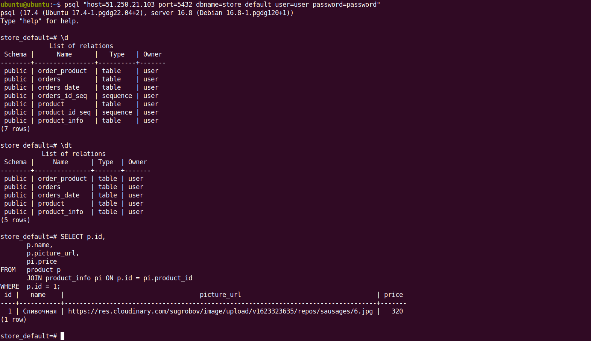
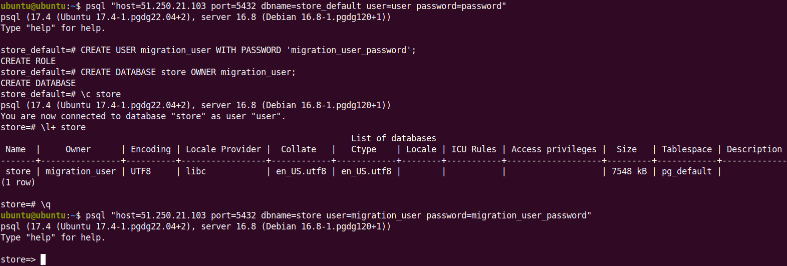
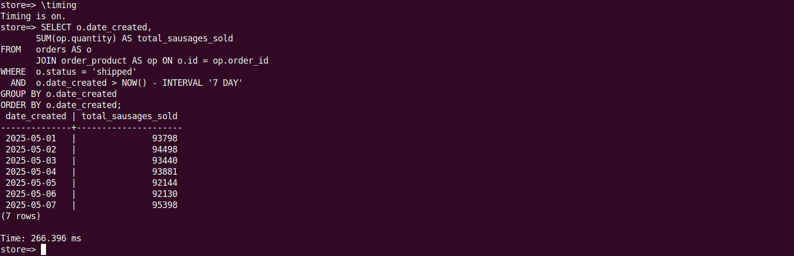

# Проектная работа дисциплины DBOps

## Требования
* Docker version 27.4.0, build bde2b89 или выше
* Docker Compose version v2.31.0-desktop.2 или выше
* psql (PostgreSQL) 16.8 или выше

## Настройка секретов в GitHub Actions

Для корректной работы `GitHub Actions`, включая возможность установления удаленного соединения с базой данных, необходимо добавить в список секретов репозитория следующие переменные окружения:

```properties
DB_HOST: <IP_address>
DB_PORT: 5432
DB_NAME: store
DB_USER: migration_user
DB_PASSWORD: migration_user_password
```

## Клонирование репозитория

Клонируйте репозиторий для получения исходных файлов проекта, включая скрипт `insert-data.sh` для создания изначальной базы данных `store_default`.

```bash
$ git clone https://github.com/DmitryFedoroff/cloud-services-engineer-dbops-project.git
```
```bash
$ cd ~/cloud-services-engineer-dbops-project
```

## Запуск PostgreSQL

Запуск контейнера `PostgreSQL` в фоновом режиме с помощью `Docker Compose` для создания локальной среды, необходимой для тестирования миграций и оптимизации базы данных.

```bash
$ docker-compose up -d
```

## Инициализация исходной структуры базы данных

Скрипт `insert-data.sh` создает исходную структуру таблиц и наполняет их данными, необходимыми для дальнейшей нормализации и оптимизации. Сделайте скрипт исполняемым с помощью команды `chmod +x`. При необходимости отредактируйте параметры подключения к `PostgreSQL` внутри скрипта.

```bash
$ chmod +x insert-data.sh
$ ./insert-data.sh
```

<details>
<summary><b>Скриншот: Выполнение скрипта начальной инициализации базы данных</b></summary>


</details>

## Изучение структуры базы данных 

Подключение к базе данных `store_default` с помощью `psql` и изучение структуры всех таблиц, используя команды `\dt` и `\d`.

```bash
$ psql "host=<IP_address> port=5432 dbname=store_default user=user password=password"
```

Вывод всех отношений (таблиц, последовательностей, представлений) в текущей базе данных `store_default`.

```sql
\d
```

Вывод только списка таблиц (без последовательностей и других объектов) в текущей базе данных `store_default`.

```sql
\dt
```

`SQL`-запрос, объединяющий данные из таблиц `product` и `product_info` для получения информации о товаре включая его цену, которая хранится в отдельной таблице.

```sql
SELECT p.id, 
       p.name, 
       p.picture_url, 
       pi.price
FROM   product p
       JOIN product_info pi ON p.id = pi.product_id
WHERE  p.id = 1;
```

<details>
<summary><b>Скриншот: Изучение начальной структуры базы данных и проверка данных</b></summary>



</details>

## Создание нового пользователя и новой базы данных

Создание нового пользователя `migration_user` c паролем `migration_user_password` в `PostgreSQL`.

```sql
CREATE USER migration_user WITH PASSWORD 'migration_user_password';
```

Создание еще одной базы данных `store` в `PostgreSQL`. Поскольку под пользователем `migration_user` будут выполняться автотесты и применяться миграции, важно, чтобы пользователь обладал достаточными правами для выполнения этих операций.

```sql
CREATE DATABASE store OWNER migration_user;
```

Переключение на новую базу данных `store`.

```sql
\c store
```
Проверка созданной базы данных.

```sql
\l+ store
```

Подключение к базе данных `store` с помощью `psql`.

```bash
psql "host=<IP_address> port=5432 dbname=store user=migration_user password=migration_user_password"
```

<details>
<summary><b>Скриншот: Создание пользователя и базы данных</b></summary>



</details>


## Содержание директории `migrations` c миграциями Flyway

  Файл                        | Назначение                                                                                                                                                                                                                                                        
|-----------------------------|------------------------------------------------------------------------------------------------------------------------------------------------------------------------------------------------------------------------------------------------------------------------------------------------------------------------------------------------------------------|
| **V001__create_tables.sql** | Создает начальную структуру базы данных. Это «черновой» вариант схемы с пятью таблицами, в которых есть дублирование данных и пока нет ограничений (например, первичных и внешних ключей). Это позволяет сначала развернуть базу и провести первые автотесты без лишних сложностей.                                                                              |
| **V002__change_schema.sql** | Приводит базу в порядок: добавляет недостающие поля (`price`, `date_created`), переносит данные из вспомогательных таблиц, настраивает ключи и связи между таблицами (ограничения целостности), а затем удаляет лишние таблицы. В этом файле происходит нормализация структуры базы - то есть избавление от повторяющихся данных и ошибок проектирования.        |
| **V003__insert_data.sql**   | Наполняет базу данными: добавляет список товаров и создает около 1 млн заказов с позициями. Данные создаются автоматически - с помощью генерации случайных значений и серий. В конце обновляется информация, нужная `PostgreSQL` для быстрой работы с этими таблицами.                                                                                           |
| **V004__create_index.sql**  | Добавляет индексы для ускорения выполнение запросов: один индекс помогает быстрее соединять таблицы, другой индекс помогает фильтровать и группировать данные по дате и статусу, а третий индекс еще сильнее ускоряет отчеты, потому что касается только доставленных заказов. В итоге при формировании отчета база данных начинает работать быстрее.            |

## Результаты выполнения автотестов

Результаты выполнения всех трех уровней тестирования, подтверждающих корректную реализацию требований к структуре базы данных, нормализации схемы и оптимизации производительности запросов. Все проверки пройдены.

<details>
<summary><b>Скриншот: Валидация трех этапов оптимизации базы данных</b></summary>


</details>

## Отчет по продажам за предыдущую неделю с группировкой по дням

```sql
SELECT o.date_created,
       SUM(op.quantity) AS total_sausages_sold
FROM   orders AS o
       JOIN order_product AS op ON o.id = op.order_id
WHERE  o.status = 'shipped'
  AND  o.date_created > NOW() - INTERVAL '7 DAY'
GROUP BY o.date_created
ORDER BY o.date_created;
```

<details>
<summary><b>Скриншот: Продажи сосисок за предыдущую неделю</b></summary>



</details>

## Контакты

- **Автор**: Дмитрий Федоров
- **Эл. почта**: [fedoroffx@gmail.com](mailto:fedoroffx@gmail.com)
- **Telegram**: [https://t.me/dmitryfedoroff](https://t.me/dmitryfedoroff) 
